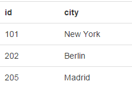

# RioTable  #

RioTable (Riot+Table) Is a flexible HTML component to generate tables with [riot.js  lib](https://github.com/muut/riotjs) from a JSON source

> (sources and samples very soon) !!!


You can use this **HTML tag **in your common  html files

### The simplest sample ###

```html
    <rtable ongetdata="getJSON">
    </rtable>
```


This is a simple definition of one table that renders **all**  JSON data returned by the callback function getJSON.  Of course we can retrieve JSON data from an AJAX method

```javascript    
    function getJSON(){
      return [
    		 {id:101, city:'New York', flag:'ny.png'},
    		 {id:202, city:'Berlin', flag:'be.png'},
    		 {id:205, city:'Madrid', flag:'md.png'}
    		 ]
    }
```

**Result:**


### The columns ###

We can specify which columns to render from JSON data  

```html
    <rtable ongetdata="getJSON">
      <rcol name="id"/>
      <rcol name="city"/>
    </rtable>   
```     

**Result:**



### Some basic options ###

Setting an id or a CSS class (for example to render table as BootStrap table),  and the width of any column is so simple:

```html
    <rtable ongetdata="getJSON" id="myrtable" class="table">
      <rcol name="id" width="20px"/>
      <rcol name="city"/>
    </rtable>   
``` 

### Formating data ###

It's very common to include our custom HTML tags inside our rendered cell like bold text, links, images, html snippets ...

As easy as:

```html
    <rtable ongetdata="getJSON" id="myrtable" class="table">
      <rcol name="id" width="20px">  <b>{id}</b> </rcol>
      <rcol name="city"/> <a href="details/?city={id}">{city}</a> </rcol>
	  <rcol name="flag"/>  </rcol>
    </rtable>   
```

**Result:**


 
### Calling RioTable Methods ###

For example we can add new data to our table when a button is clicked. 

```html
    <button onclick="addNewData()">Change Table</button>
    
	<script>
		function addNewData(){
			var mytable = document.getElementById('myrtable');
			mytable.Load( [{id:255, city:'Paris', flag:'pa.png'}] );
		}
	</script>
```


    